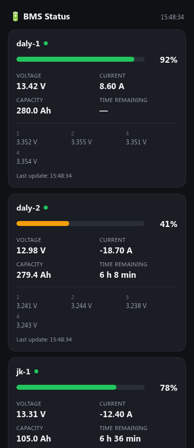

# signalk-bms-ble

SignalK plugin that reads state of charge, voltage, current, cell voltages
and capacity from JK-BMS and Daly Smart BMS battery management systems over
Bluetooth LE, and publishes them under `electrical.batteries.<id>.*`.

## Supported hardware

- **JK-BMS**, JK02 protocol family (BLE UART passthrough, service `0xFFE0`).
  Verified against JK-B2A8S20P hardware.
- **Daly Smart BMS**, D2 dialect (Modbus-RTU-style framing over BLE, service
  `0xFFF0`). Verified against BMS-ST103-303E hardware.

Both protocols have variants across firmware/board generations that use
different byte offsets for the same fields (see
`diag/findings/PROTOCOL_NOTES.md`). The plugin validates every parsed
reading against physically sane ranges (SOC 0-100%, voltage, current) and
drops + reports readings that fail this check instead of silently
publishing wrong numbers — if your device reports "implausible reading" in
the SignalK log, please open a GitHub issue with your BMS model/firmware so
support for that variant can be added.

## Requirements

- SignalK server, Node.js >= 18.
- **Linux with BlueZ.** Developed and tested on Raspberry Pi OS / Debian
  with BlueZ 5.66-5.85. The Python BLE library used here (`bleak`) also has
  macOS (CoreBluetooth) and Windows (WinRT) backends, so those platforms may
  work, but this plugin's connection retry/timeout/watchdog logic was
  written against BlueZ-specific behavior and hasn't been exercised there.
- **Python 3** with the standard `venv` module. On Debian/Ubuntu/Raspberry
  Pi OS this is a separate package from the base `python3` install:
  ```
  sudo apt install python3-venv
  ```
  Without it, the plugin's first-run virtual environment setup fails with
  an `ensurepip is not available` error.
- Internet access on first plugin start (to `pip install bleak` into the
  plugin's own virtual environment, created automatically under `.venv/`).
- **Bluetooth permissions.** SignalK typically runs as a non-root user. On
  most distros that user needs to be in the `bluetooth` group (or have
  equivalent BlueZ D-Bus policy permissions) to use Bluetooth LE at all:
  ```
  sudo usermod -aG bluetooth <signalk-user>
  ```
  then log the user out/in (or reboot) for the group change to take
  effect. Without this, connections typically fail with a permission or
  D-Bus access error.

## Installation

```
cd ~/.signalk
npm install signalk-bms-ble
```

Restart signalk-server, then enable the plugin under **Server → Plugin
Config** and add your devices to the device list (see "Finding your
device's Bluetooth address" below).

## Configuration

Each entry in the device list needs:

| Field | Meaning |
|---|---|
| `id` | SignalK battery instance id, used as `electrical.batteries.<id>.*` — must be unique across devices, e.g. `house1` |
| `type` | `jk` or `daly` |
| `address` | Bluetooth MAC address of the BMS, e.g. `11:22:33:44:55:66` |
| `enabled` | Uncheck to stop polling a device without deleting its config |

### Finding your device's Bluetooth address

The plugin does not auto-discover devices — with multiple BMS of the same
brand this is ambiguous by service UUID alone, and you'd risk pointing an
`id` at the wrong physical battery. Instead, find the address with the
diagnostic scripts in `diag/` (own virtualenv under `diag/venv/`, see
`diag/README.md`):

```
cd diag
python3 -m venv venv && venv/bin/pip install bleak
venv/bin/python scan.py
```

This lists nearby BLE devices; match yours by name (JK/Daly units usually
advertise a manufacturer-ish name) or by process of elimination (power one
battery off/on and see which entry appears/disappears).

## Published SignalK paths

Per configured device, under `electrical.batteries.<id>.*`:

| Path | Meaning | Condition |
|---|---|---|
| `capacity.stateOfCharge` | SOC, 0-1 (SignalK convention) | always |
| `voltage` | Pack voltage in V | always |
| `current` | Current in A (negative = discharging) | always |
| `cellVoltages.<n>.voltage` | Individual cell voltages | always |
| `capacity.actual` | Current full-charge capacity in J (BMS-reported Ah × voltage × 3600 — not a fixed nameplate value, drifts with cell aging/calibration) | when the BMS reports a capacity |
| `capacity.remaining` | Remaining capacity in J (SOC × `capacity.actual`) | same as above |
| `capacity.timeRemaining` | Time to empty in s | same as above, only while discharging (`current < 0`); uses a smoothed current (~45s time constant) so brief load spikes don't make the value jump around |

`capacity.timeRemaining` is what an NMEA2000 plotter (PGN 127506) shows as
"time remaining" next to SOC/voltage/current.

## Status page

`/signalk-bms-ble/` (same host/port as the SignalK server, e.g.
`http://<signalk-host>/signalk-bms-ble/`) shows a mobile-friendly HTML page
with live values for every device reporting cell voltages (SOC bar,
voltage, current, capacity, time remaining, cell voltages), refreshing
itself every 10s. Also listed as "BMS Status" in SignalK's own webapp
overview (App Dock etc.).



(Screenshot uses example data, not a live connection.)

Technically a static page under `public/index.html`, mounted automatically
by SignalK under `/<package-name>/` via the `signalk-webapp` keyword in
`package.json` (the same mechanism used by e.g. `@signalk/freeboard-sk` or
`@signalk/app-dock`) — this mount point sits outside the admin login
SignalK enforces on `/plugins/*`. The page fetches its data client-side
from the standard, unauthenticated SignalK REST API
(`/signalk/v1/api/vessels/self/electrical/batteries`), so there's no
server-side rendering code in the plugin itself.

## Architecture

- `ble_worker.py` — **a single long-lived** Python process (via
  `bleak`/BlueZ-DBus). Each configured BMS gets its own `asyncio` task that
  **connects once and stays connected** (no poll/disconnect cycle),
  continuously receiving readings via BLE notifications. Discovery+connect
  attempts are serialized across all devices via a shared `asyncio.Lock`
  (BlueZ only allows one such operation at a time), bounded by an outer
  timeout (`LOCK_TIMEOUT_S`) so one stuck device can't block the others. A
  watchdog thread hard-exits the whole process if something still hangs
  past `WATCHDOG_TIMEOUT_S`. Results go to stdout as newline-delimited
  JSON. Runs in its own virtual environment (`.venv/`, created
  automatically on first plugin start). See `diag/findings/PROTOCOL_NOTES.md`
  for the decision history (including why persistent connections instead of
  poll cycles).
- `lib/bleWorker.js` — spawns/supervises the Python process, parses its
  JSON lines, restarts it automatically on crash.
- `index.js` — SignalK plugin entry point: config schema (device list,
  per-device enable/disable), converts readings into SignalK deltas
  (including converting the BMS-reported Ah capacity into SignalK's
  joule-based `capacity.actual`/`.remaining`/`.timeRemaining`, using a
  smoothed current for the time-remaining calculation), shows live values
  on the plugin config page.

**Why a Python process instead of a pure Node BLE module?**
`@abandonware/noble` typically needs exclusive HCI access and conflicts
with a running `bluetoothd`. `node-ble` (DBus/BlueZ, like bleak) was
tested but hung indefinitely on connect, with no timeout of its own.
`bleak` is the only library that proved reliable against the real
hardware — see `diag/findings/PROTOCOL_NOTES.md`.

**Why persistent connections instead of poll/disconnect cycles?**
An earlier approach reconnected for every reading (discover → connect →
read → disconnect). Repeated discovery turned out live to be the main
source of intermittent "did not advertise" failures — a device could work
reliably for many cycles and then fail several times in a row, even though
a plain `bluetoothctl scan` always found it. A live experiment also
confirmed that a single BLE adapter can hold several simultaneously open
connections — BlueZ's "only one operation at a time" limit applies only to
*establishing* connections, not to *holding* them open. Details in
`diag/findings/PROTOCOL_NOTES.md`.

## Adding a new BMS brand

1. In `ble_worker.py`: write a new `Protocol` subclass (see
   `JkProtocol`/`DalyProtocol` as templates) — implement `notify_char`,
   `write_char`, `request()`, `feed()`; optionally `extra_requests()` (if
   the device only starts pushing live data after a second request) and
   `request_interval_s` (if the device doesn't keep pushing on its own and
   needs periodic re-requesting — see `DalyProtocol`). Register it in
   `PROTOCOLS`.
2. In `index.js`: add the new type key + display name to `KNOWN_TYPES`.

No other code needs to change — the device list in the plugin config stays
MAC-address-based and type-agnostic.

## Diagnostic scripts

`diag/` contains the scripts originally used to reverse-engineer the BMS
protocols (`scan.py`, `inspect_gatt.py`, `probe.py`, own virtualenv under
`diag/venv/`). Useful for investigating a new/unknown BMS model before
writing a new `Protocol` class, or for finding a device's Bluetooth
address (see "Finding your device's Bluetooth address" above).

## Known limitations

- The discharge case (negative current) for the Daly protocol has so far
  only been verified against the register formula, not cross-checked
  against a real discharge load.
- No pairing/bonding needed; an open GATT connection is enough. Only one
  connection per BMS at a time — the vendor's own phone app must not be
  connected at the same time as the plugin.
- On Raspberry Pi hardware with onboard BLE (e.g. Pi 4B, Broadcom chip via
  UART rather than USB), occasional multi-minute rough phases have been
  observed (BlueZ takes unusually long for discovery/scanner teardown),
  typically shortly after a reboot. The system has recovered on its own in
  every observed case; `LOCK_TIMEOUT_S` prevents an affected device from
  blocking the others while this happens. This has not been observed on
  USB Bluetooth adapters. Details in `diag/findings/PROTOCOL_NOTES.md`.
- **On very low-RAM hardware** (e.g. a Raspberry Pi with 512MB or less),
  check free RAM before installing (`free -h`) and avoid installing/starting
  this plugin at the same time as other RAM-heavy setup work — an earlier
  per-poll-subprocess design (since replaced by the single persistent
  process described above) pushed a 416MB Pi into swapping badly enough to
  make SignalK itself unresponsive. See `diag/findings/PROTOCOL_NOTES.md`.

## Example: a multi-battery setup

For reference, a device list covering a JK-BMS house bank plus two Daly
starter/house banks might look like this. Capacities are whatever each
BMS itself reports (see above) — not derived from any model number:

| id | type | address | capacity |
|---|---|---|---|
| house1 | jk | 11:22:33:44:55:66 | ~105 Ah |
| starter | daly | 11:22:33:44:55:67 | ~100 Ah |
| house2 | daly | 11:22:33:44:55:68 | ~280 Ah |

## License

AGPL-3.0-only, see `LICENSE`.
